# 云开发 quickstart

这是云开发的快速启动指引，其中演示了如何上手使用云开发的三大基础能力：

- 数据库：一个既可在小程序前端操作，也能在云函数中读写的 JSON 文档型数据库
- 文件存储：在小程序前端直接上传/下载云端文件，在云开发控制台可视化管理
- 云函数：在云端运行的代码，微信私有协议天然鉴权，开发者只需编写业务逻辑代码

## 参考文档

- [云开发文档](https://developers.weixin.qq.com/miniprogram/dev/wxcloud/basis/getting-started.html)

# supermarket_applet

# 搭建步骤
    1 开通 云开发
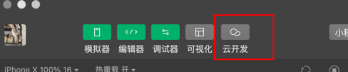

    2上 传所有云函数

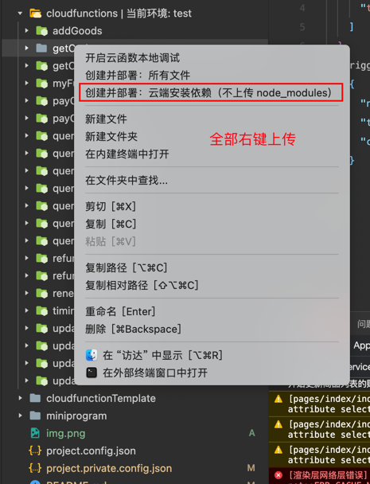

    timingSendGold定时更新果币信息。需要上传触发器

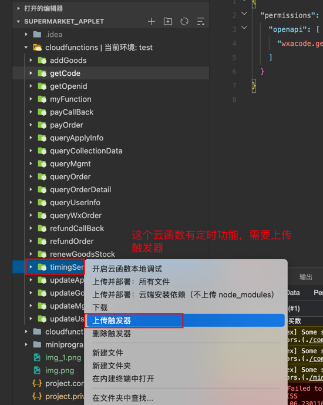

    3 配置数据库表       
    helpQuestion 帮助问题相关
    swiper       轮播图相关
    category     商品分类相关
    goodsList    商品信息列表
    order        商品订单数据
    address      收获地址
    deliveryTime 配送时间
    opinion      意见表
    applyService 订单售后信息表
    shareRelation 分享的相关数据
    userInfo     用户信息
    management   管理员信息

    直接点击添加以上表名即可
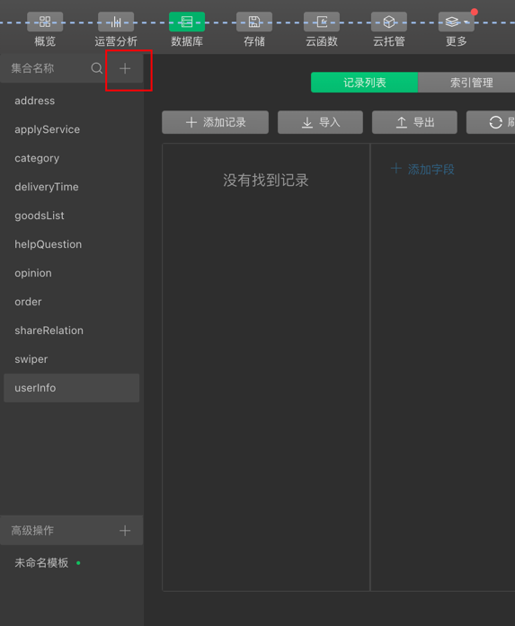

    4.完善代码内配置(全量搜索 'TODO 配置' 我在需要配置的地方加上了注解）
    app.js 
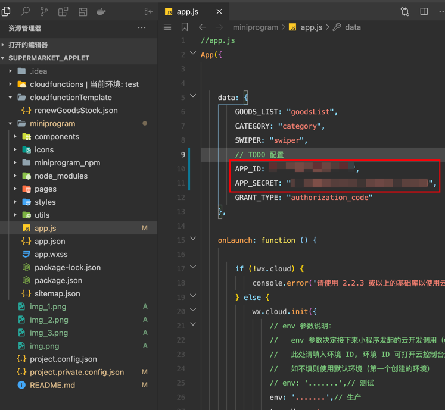
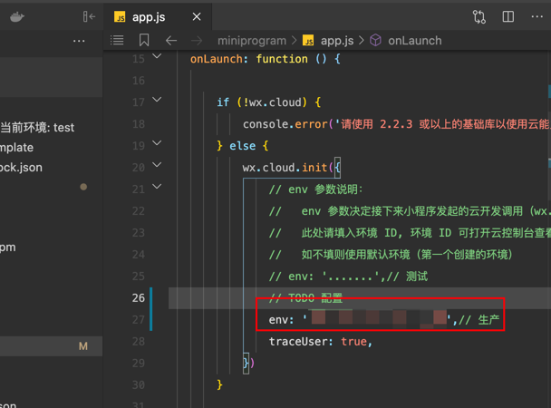

    完成以上配置后，随便点点。除了一些静态资源找不到的报错， 控制台就没有报错信息了

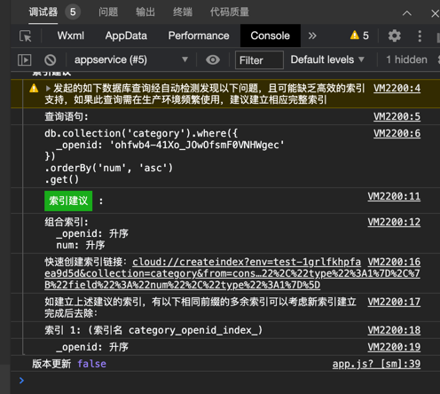

    5.下面开始完善一些基础数据。(记得修改表对应的数据权限,详见踩坑记录，可以直接用数据库json文件导入到对应表格内）
    swiper       轮播图相关
    category     商品分类相关
    deliveryTime 配送时间

    
    6.我的->设置->商品管理-> 右下角+号 添加商品信息
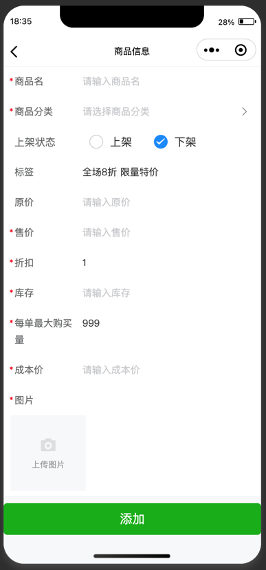
    
    7. 添加完成后你会发现商品列表并没有商品。说明你的商品表的的数据权限没有打开。目前就这些工作。

#   搭建踩坑记录
    1.数据库表里明明有数据，但是查询是返回结果为空？
    答：保证表名及数据无误的情况下。查看该表的权限。基础数据可设置成 第一个
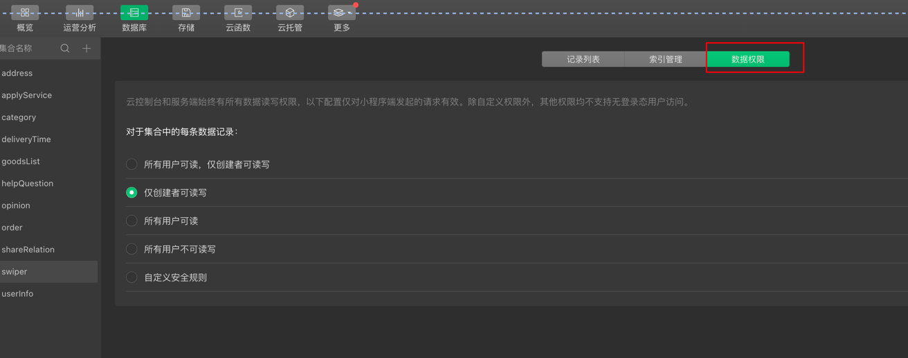

    2.显示支付成功，但是在后台查不到？
    答：方便测试代码内已经把支付功能给注解掉了。默认支付成功。生产逻辑是在 payCallBack这个云函数内接收支付回调信息后修改状态
        所以在没有支付功能的资质下只能手动更改订单状态
    0 取消
    1 下单 待支付
    2 支付成功，待商家接单
    3 打包中
    4 打包完成，待配送
    5 配送中
    6 订单已签收
    7 售后（已经申请售后）
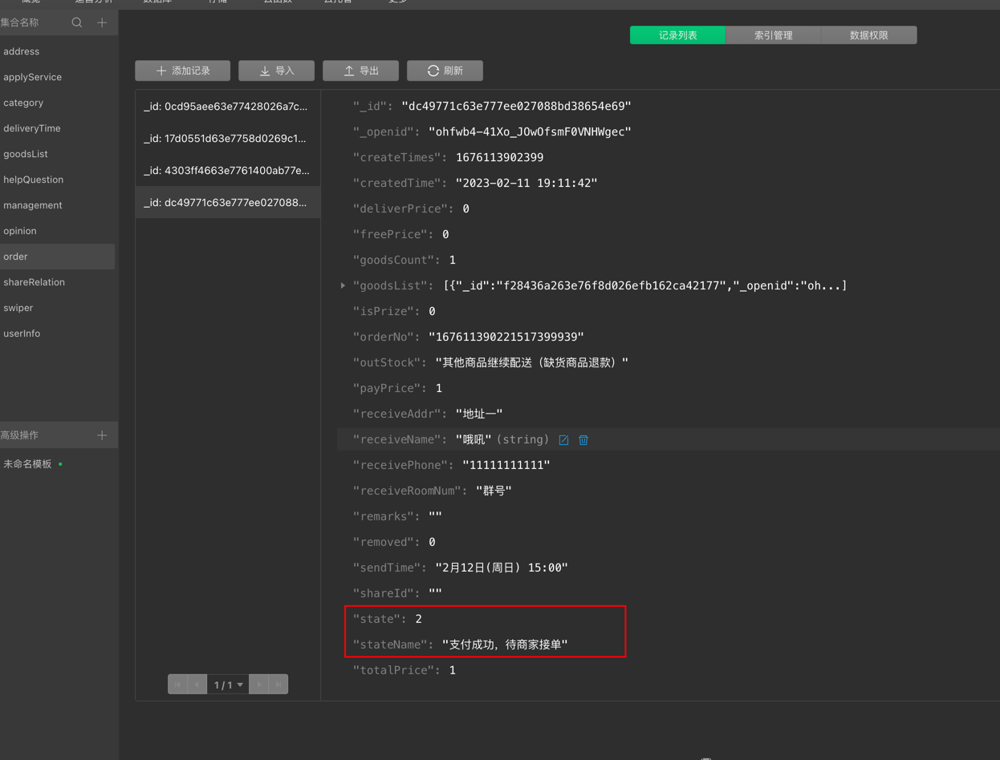

        
## 如果以上对您有帮助，您也可以通过以下方式支持我。让我们在力所能及的范围内互帮互助✌️
    1. 时光伴侣 是我全职开发的一款受柳比歇夫时间统计法影响诞生的一个时间统计app,
        可的话捧个场,试用下,推荐给身边需要的同学，ios端的同学劳烦给个好评(让苹果爸爸给我点自然流量)！！
        安卓(暂时没有上应用市场)感兴趣的话可以扫码下载
  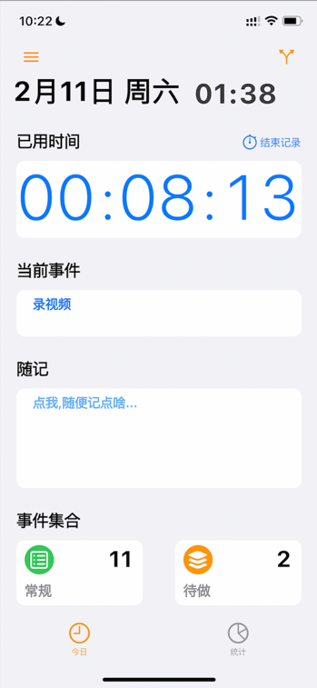 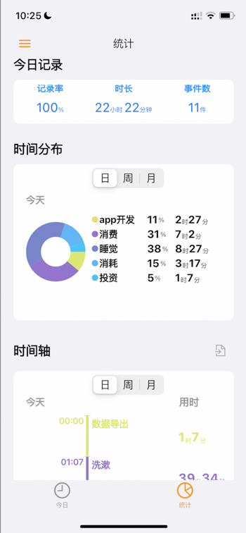 

    2.直接投喂(1元2元不嫌少,8元9元不嫌多）
       

    3.给个小星星✨✨✨

### 联系方式
    B站: 时光伴侣App
    邮箱: sgbl2022@163.com
    
